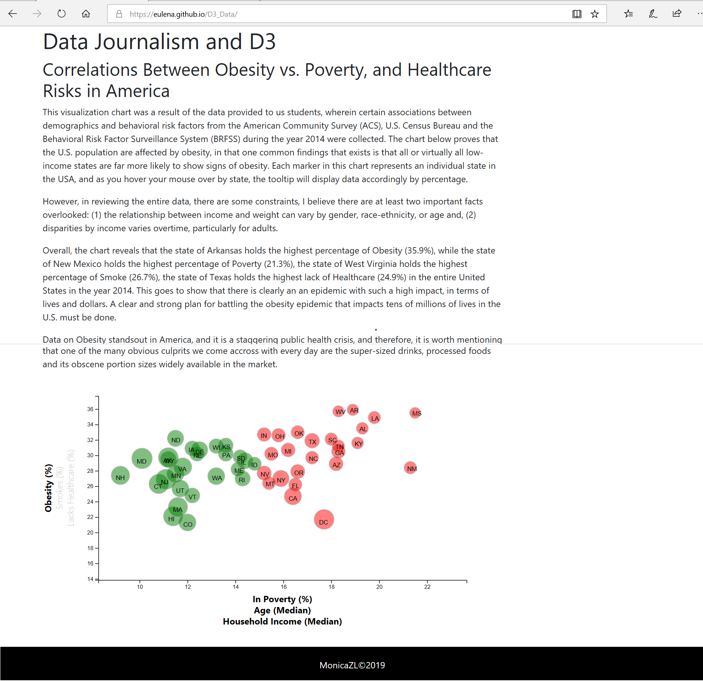

## Submitted By: Monica Zulueta-Linsangan
## Date: July 6, 2019

# Data Journalism and D3

This project/homework provides an analysis and visulization of healthcare risks in the United States.

[View My Website](https://eulena.github.io/D3_Data/)

## The following steps were completed to accomplish the homework:

### Step 1: Data Source for ETL development

  * Data from the [U.S. Census Bureau's American Community Survey](http://factfinder.census.gov/faces/nav/jsf/pages/searchresults.xhtml)
  
  * Data from the [Behavioral Risk Factor Surveillance System](https://chronicdata.cdc.gov/Behavioral-Risk-Factors/BRFSS-2014-Overall/5ra3-ixqq)
  
  * Combined and cleaned-up the two datasets.
  
### Step 2: Data visulization 
  * Created a scatter plot by d3.js for visualization.

  * Initialize d3-tip.js plugin for user to hover over the element.
  
  * Built clickable events for an interactive chart for each axis.
  
  * Created an animation for data transitions for each axis.
  
### Screenshot of Launched Webpage
  

